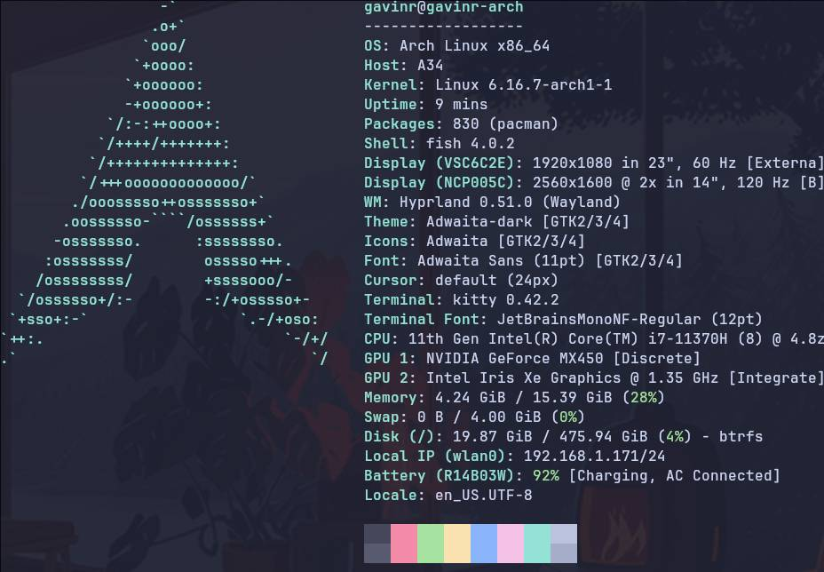

# Dotfiles

> [!WARNING]
> This repo haven't been tested on a fresh install. Use at your own risks.

This repo contains the list of installed packages as well as the configuration associated.
I use Hyprland on Arch (btw) and stow to manage the dotfiles, see below how to use it.




### How to install:

#### Packages
Install all packages listed in installed_packages

#### Configuration
```bash
stow config
```

#### Root config
```bash
# Plymouth / Grub config / udev rules
sudo stow -t / root
```

#### Grub
```bash
# Grub config can't use symlink
cp root/etc/default/grub /etc/default
cp -R root/usr/share/grub/themes/catppuccin-mocha-grub-theme /usr/share/grub/themes
sudo grub-mkconfig -o /boot/grub/grub.cfg
```

#### Wallpaper services
```bash
systemctl --user enable swww.service
systemctl --user start swww.service
systemctl --user enable set-wallpaper.service
systemctl --user start set-wallpaper.service
```


