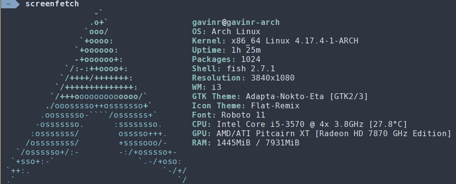

# Dotfiles for my main system



## Keyboard mapping

I replace the Caps Lock with Angle brackets

```
# Create map file
xmodmap -pke > ~/.Xmodmap
# Find key to remap
xev | awk -F'[ )]+' '/^KeyPress/ { a[NR+2] } NR in a { printf "%-3s %s\n", $5, $8 }'
# Edit Xmodmap file and reload with
xmodmap ~/.Xmodmap
```


